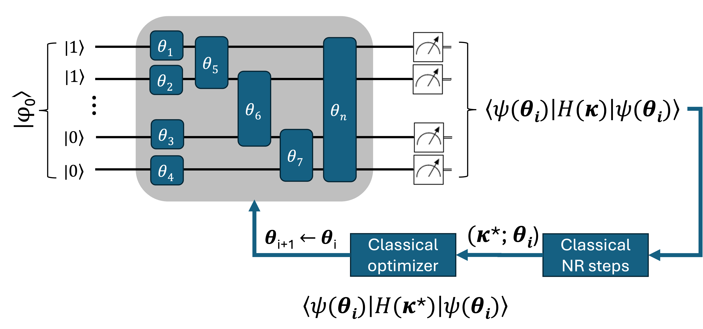

.. _oo_vqe_class:

oo-VQE
======

.. _oo_vqe_workflow:

    Schematic representation of an orbitally-optimized VQE workflow.
    :math:`\boldsymbol \theta` and :math:`\boldsymbol \kappa` represent
    the set of circuit and orbital rotation parameters, respectively.
    The expectation values of :math:`H` are minimized via a classical two-step process; NR stands for Newton-Raphson.

The oo-VQE algorithm (refer to the figure) is implemented in two other dedicated classes:
:class:`qc2.algorithms.qiskit.oo_vqe.oo_VQE` and :class:`qc2.algorithms.pennylane.oo_vqe.oo_VQE`.
It is important to note that, in addition to handling circuit parameters, oo-VQE also optimizes
the initial Hartree-Fock molecular orbital coefficients through
additional classical Newton-Raphson steps (:math:`C'_{\rm MO} \rightarrow e^{-\boldsymbol \kappa} C_{\rm MO}`) . This is done by resorting to analytic
first and second derivatives of the energy with respect to :math:`\boldsymbol \kappa` as
implemented in the :class:`~qc2.algorithms.utils.orbital_optimization.OrbitalOptimization` class; for details, see :cite:p:`Siegbahn:1981,Mizukami:2020,Yalouz:2021,Zhao:2023`.

Similarly to VQE, the ``oo-VQE`` algorithm class in qc2 is primarily designed to be instantiated through the :attr:`qc2Data.algorithm`
attribute; this is further explained in :ref:`run_algorithms_with_qc2Data`. However, it can also be instantiated
and operated independently, as long as an instance of :class:`~qc2.data.data.qc2Data` is available.
An illustrative example is shown below:

.. code-block:: python
    :linenos:
    :emphasize-lines: 23-30,34

    from ase.build import molecule

    from qiskit_algorithms.optimizers import SLSQP
    from qiskit.primitives import Estimator

    from qc2.data import qc2Data
    from qc2.algorithms.qiskit import oo_VQE
    from qc2.algorithms.utils import ActiveSpace

    # set ASE Atoms object
    mol = molecule('H2O')

    # instantiate qc2Data class
    qc2data = qc2Data(
        molecule=mol,
        ...
    )

    # ... run qchem ab initio HF calculation via qc2-ASE 

    # set up oo-VQE class
    oo_vqe = oo_VQE(
        qc2data=qc2data,
        active_space=ActiveSpace(
            num_active_electrons=(2, 2),
            num_active_spatial_orbitals=4
        ),
        mapper='jw',
        optimizer=SLSQP(),
        estimator=Estimator(),
    )

    # run algorithm
    oo_vqe.run()