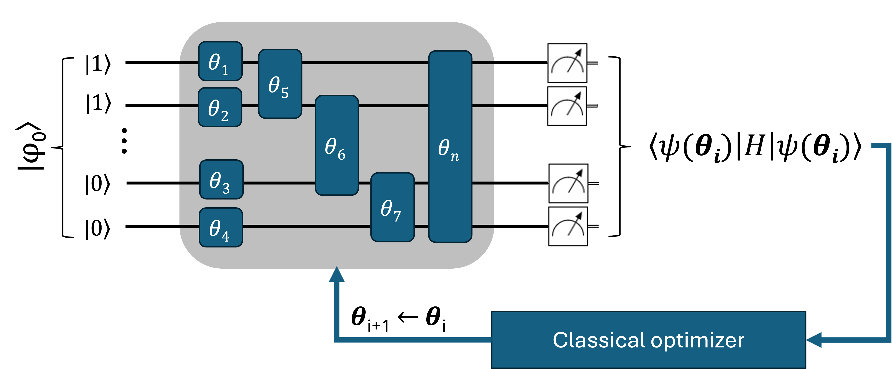

.. _vqe_class:

VQE
===

.. _vqe_workflow:

    Schematic representation of a VQE workflow. :math:`\boldsymbol \theta` represents
    the set of circuit parameters which are variationally optimized via an external classical routine.
    Expectation values of the molecular Hamiltonian :math:`H` (cost function) are evaluated at circuit level. 

The VQE algorithm can be invoked through
the :class:`qc2.algorithms.qiskit.vqe.VQE` and :class:`qc2.algorithms.pennylane.vqe.VQE` classes.
Despite requiring a few SDK-specific details, in general
the algorithm and its instantiation entails the following input information:

* **Reference state & occupation numbers**: a reference quantum circuit and initial qubit states; this is by default ``Hartree-Fock``.
* **Molecule active space**: this determines the total number of qubits and is input as an instance of :class:`~qc2.algorithms.utils.active_space.ActiveSpace`.
* **Ansatz**: type of variational form used; by default, this is set to ``UCCSD``.
* **Initial circuit parameters**: Initial guesses for the ansatz variational parameters :math:`\theta_{i}`.
* **Fermionic-to-qubit mapper & qubit Hamiltonian**: Strategy to transform the initial fermionic Hamiltonian (constructed from classical qchem data) to qubit space; by default, this set to ``Jordan-Wigner``.
* **Classical optimizer**: the optimization routine for the circuit variational parameters. Default routines are: ``SLSQP`` for `Qiskit Nature <https://qiskit.org/ecosystem/nature/>`_ and ``GradientDescentOptimizer`` for `PennyLane <https://pennylane.ai/>`_ .

Like in the case of qc2-ASE calculators, the algorithm ``VQE`` class is naturally abstracted within :class:`~qc2.data.data.qc2Data`. So,
in actual runs, users only need to instantiate it as part of its :attr:`~qc2.data.data.qc2Data.algorithm` method (to be discussed in :ref:`run_algorithms_with_qc2Data` section).
For illustrative purposes only, the following is a pseudo-code example demonstrating how ``VQE`` can be instantiated independently:

.. code-block:: python
    :linenos:
    :emphasize-lines: 21-28

    from ase.build import molecule

    from qiskit_algorithms.optimizers import COBYLA
    from qiskit.primitives import Estimator

    from qc2.data import qc2Data
    from qc2.algorithms.qiskit import VQE
    from qc2.algorithms.utils import ActiveSpace

    # set ASE Atoms object
    mol = molecule('H2')

    # instantiate qc2Data class
    qc2data = qc2Data(
        molecule=mol,
        ...
    )

    # set up VQE class
    vqe = VQE(
        qc2data=qc2data,
        active_space=ActiveSpace(
            num_active_electrons=(1, 1),
            num_active_spatial_orbitals=2
        ),
        mapper='bk',
        optimizer=COBYLA(),
        estimator=Estimator(),
    )

where the ``active_space`` argument is set to an instance of the :class:`~qc2.algorithms.utils.active_space.ActiveSpace` class. The
``'bk'`` string in ``mapper`` invokes the Bravyi-Kitaev fermionic-to-qubit transformation
(qiskit_nature.BravyiKitaevMapper) as implemented in :class:`~qc2.algorithms.utils.mappers.FermionicToQubitMapper`

A corresponding example using :class:`qc2.algorithms.pennylane.vqe.VQE` is:

.. code-block:: python
    :linenos:
    :emphasize-lines: 20-27

    from ase.build import molecule

    import pennylane as qml

    from qc2.data import qc2Data
    from qc2.algorithms.pennylane import VQE
    from qc2.algorithms.utils import ActiveSpace

    # set ASE Atoms object
    mol = molecule('H2')

    # instantiate qc2Data class
    qc2data = qc2Data(
        molecule=mol,
        ...
    )

    # set up VQE class
    vqe = VQE(
        qc2data=qc2data,
        active_space=ActiveSpace(
            num_active_electrons=(1, 1),
            num_active_spatial_orbitals=2
        ),
        mapper='jw',
        optimizer=qml.GradientDescentOptimizer(stepsize=0.5),
        device='default.qubit'
    )
