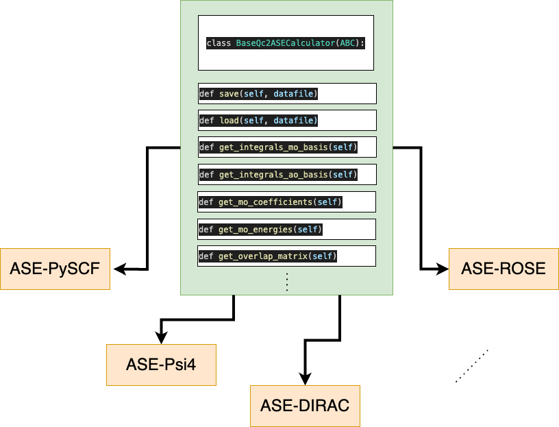

.. _build_ASEs:

Building your own qc2-ASE calculator
====================================

.. _qc2_ase_base_class:

    Schematic representation of the ``BaseQc2ASECalculator`` class inherited by all qc2-ASE calculators.

Customizing your traditional ASE calculator for use with qc2, *i.e.*, as a qc2-ASE calculator, is quite straightforward.
As the scheme above shows, all qc2-ASE calculators are child classes of the original ASE calculator
and the abstract :class:`~qc2.ase.qc2_ase_base_class.BaseQc2ASECalculator`. This latter has been specifically designed for
qc2 and contains additional methods that should be implemented by the user.

An schematic example demonstrating how this has been done for `Psi4 <https://psicode.org/>`_ is provided below:

.. code-block:: python

    # import original Psi4 calculator from ASE
    from ase.calculators.psi4 import Psi4 as Psi4_original

    # import BaseQc2ASECalculator from qc2
    from .qc2_ase_base_class import BaseQc2ASECalculator

    class Psi4(Psi4_original, BaseQc2ASECalculator):
        """qc2-ASE calculator for Psi4.

        Args:
            Psi4_original: Original ASE-Psi4 calculator.
            BaseQc2ASECalculator: Base class for
                ase calculartors in qc2.
        """
        def __init__(self, *args, **kwargs) -> None:
            """Psi4-qc2-ASE calculator.

            **Example**

            >>> from ase import Atoms
            >>> from ase.build import molecule
            >>> from qc2.ase import Psi4
            >>>
            >>> molecule = Atoms(...) or molecule = molecule('...')
            >>> molecule.calc = Psi4(method='hf', basis='sto-3g', ...)
            >>> energy = molecule.get_potential_energy()
            >>> gradient = molecule.get_forces()
            """
            Psi4_original.__init__(self, *args, **kwargs)
            BaseQc2ASECalculator.__init__(self)

        # implement below all additional "abstract" methods of BaseQc2ASECalculator

        def save ...

        def load ...

        def get_integrals_mo_basis ...

        ....

Examples of full implementations of all such additional methods can be found
in :class:`~qc2.ase.pyscf.PySCF` and :class:`~qc2.ase.psi4.Psi4`.

.. note::

    Not all such methods need to be implemented for you to run simple VQE calculations with qc2.
    This is the reason why they are not explicitly marked with the ``@abstract`` decorator in the
    :class:`~qc2.ase.qc2_ase_base_class.BaseQc2ASECalculator` class.

The minimum set that should be implemented includes: [#f1]_

* :meth:`~qc2.ase.qc2_ase_base_class.BaseQc2ASECalculator.save`
* :meth:`~qc2.ase.qc2_ase_base_class.BaseQc2ASECalculator.load`
* :meth:`~qc2.ase.qc2_ase_base_class.BaseQc2ASECalculator.get_integrals_mo_basis`

There is also an additional set that is desirable but not strictly necessary.
They will become more crucial in the near future with the extension of qc2 to include
`orbital-optimized VQE <https://github.com/Emieeel/auto_oo>`_:

* :meth:`~qc2.ase.qc2_ase_base_class.BaseQc2ASECalculator.get_integrals_ao_basis`
* :meth:`~qc2.ase.qc2_ase_base_class.BaseQc2ASECalculator.get_molecular_orbitals_coefficients`
* :meth:`~qc2.ase.qc2_ase_base_class.BaseQc2ASECalculator.get_molecular_orbitals_energies`
* :meth:`~qc2.ase.qc2_ase_base_class.BaseQc2ASECalculator.get_overlap_matrix`

Indeed, the calculation of integrals and molecular orbital properties,
as well as the way they are stored, are specific to each quantum chemistry program and should be implemented accordingly.
Examples of such implementations can be found in the :mod:`qc2.ase` module.

.. important::

    In :class:`~qc2.ase.qc2_ase_base_class.BaseQc2ASECalculator`, there is also a set of
    helper methods designed to simplify the process of implementing
    the `QCSchema <https://molssi.org/software/qcschema-2/>`_
    within :meth:`~qc2.ase.qc2_ase_base_class.BaseQc2ASECalculator.save`.
    They are:

    * :meth:`~qc2.ase.qc2_ase_base_class.BaseQc2ASECalculator.instantiate_qcschema`
    * :meth:`~qc2.ase.qc2_ase_base_class.BaseQc2ASECalculator.instantiate_qctopology`
    * :meth:`~qc2.ase.qc2_ase_base_class.BaseQc2ASECalculator.instantiate_qcproperties`
    * :meth:`~qc2.ase.qc2_ase_base_class.BaseQc2ASECalculator.instantiate_qcmodel`
    * :meth:`~qc2.ase.qc2_ase_base_class.BaseQc2ASECalculator.instantiate_qcprovenance`
    * :meth:`~qc2.ase.qc2_ase_base_class.BaseQc2ASECalculator.instantiate_qcwavefunction`

    These do not require any additional implementation from you and can be used as they are.

.. rubric:: Footnotes

.. [#f1] This is the current state of :class:`~qc2.ase.dirac.DIRAC` qc2-ASE calculator.
