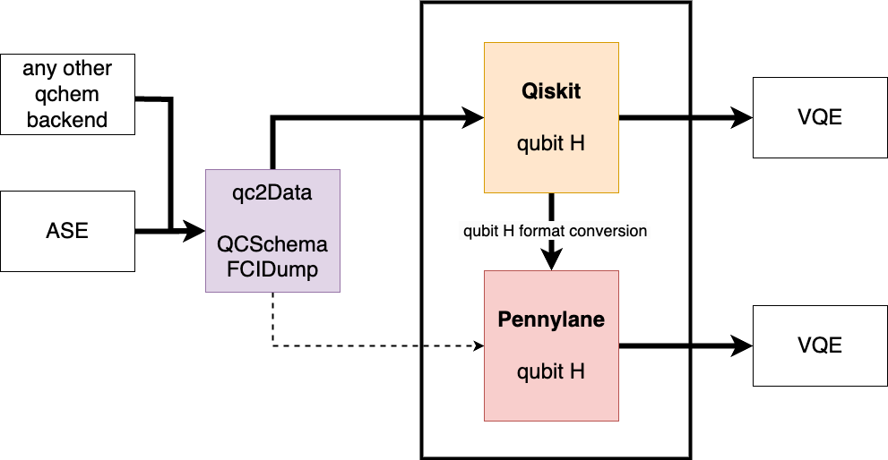

.. _qc2workflow_section:

qc2 workflow
============

.. _code_workflow:

    Code workflow diagram

qc2 is designed around the :class:`~qc2.qc2_driver.QC2`. This class connects with traditional quantum chemistry codes via
custom qc2-ASE calculators and the formatted `QCSchema <https://molssi.org/software/qcschema-2/>`_ or FCIdump :cite:p:`FCIDump:1989`
data files generated from them. :class:`~qc2.qc2_driver.QC2` is then able to read these files and create instances of
``FCIdump`` and ``QCSchema``
dataclasses; see `Qiskit Nature documentation <https://qiskit.org/ecosystem/nature/apidocs/qiskit_nature.second_q.formats.html>`_.

.. note::

    Since qc2 primarily operates with data files, you could, in principle,
    use any traditional quantum chemistry backend other than `ASE <https://wiki.fysik.dtu.dk/ase/>`_
    to generate qchem data. This is possible as long as your backend dumps the necessary data in
    accordance with the above-mentioned schema.

With the ``FCIdump`` and ``QCSchema`` dataclasses at hand, :class:`~qc2.qc2_driver.QC2` can create the second-quantized Hamiltonian via
:meth:`~qc2.qc2_driver.QC2.get_ferminionic_hamiltonian`
and seamlessly integrate with
`Qiskit <https://qiskit.org/>`_  and `Pennylane <https://pennylane.ai/>`_ to build up the active-space molecular Hamiltonian in
qubit format.

Once an appropriate form of the qubit Hamiltonian is obtained,
VQE calculations can be performed using the quantum computing library of choice.
Examples on how to perform such calculations will be later given in the :ref:`tutorial_section`
and can also be found in the ``examples`` directory.
