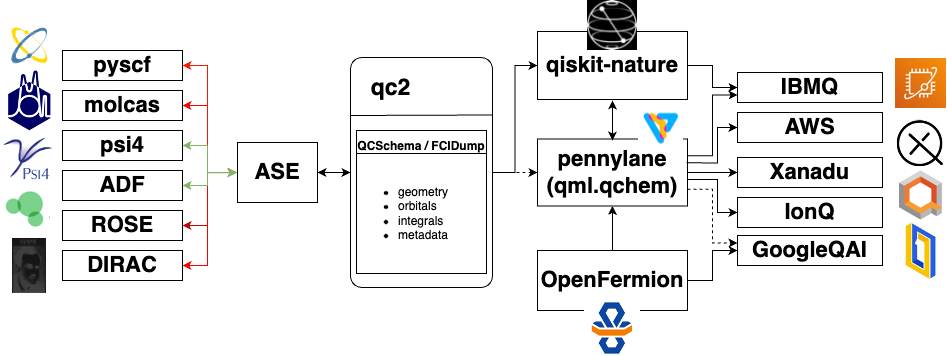

.. qc2 documentation master file, created by
   sphinx-quickstart on Wed May 5 22:45:36 2021.
   You can adapt this file completely to your liking, but it should at least
   contain the root `toctree` directive.

Welcome to qc2's documentation!
==========================================================

.. _about_section:

About qc2
=========

.. _code_structure:

    Code structure diagram

qc2 is a modular software designed to seamlessly integrate traditional computational chemistry codes
and quantum computing frameworks.
It is specifically crafted for hybrid quantum-classical workflows
such as the variational quantum eigensolver (VQE) algorithm :cite:p:`REV_VQE:2022,REV_QC4QC:2019`.
The software relies on custom `ASE calculators <https://wiki.fysik.dtu.dk/ase/>`_ as well as formatted data files
(*e.g.*, `QCSchema <https://molssi.org/software/qcschema-2/>`_ or FCIDump :cite:p:`FCIDump:1989`) to efficiently offload 1- and 2-electron
integrals needed by various Python quantum computing libraries; see :ref:`code_structure`.

The qc2 software is a direct outcome of the `QCforQC project <https://research-software-directory.org/projects/qcforqc>`_,
a collaboration between `Netherlands eScience Center <https://www.esciencecenter.nl/>`_,
`Vrije Universiteit Amsterdam (VU) <https://vu.nl/nl>`_ and `SURF <https://www.surf.nl/>`_.

Current status of qc2
=====================

In its current version, qc2 can run hybrid quantum-classical computations using
both `Qiskit Nature <https://qiskit.org/ecosystem/nature/>`_ and `PennyLane <https://pennylane.ai/>`_,
along with the following computational chemistry programs:

* `PySCF <https://pyscf.org/>`_
* `Psi4 <https://psicode.org/>`_
* `DIRAC <https://www.diracprogram.org/>`_
* `ROSE <https://gitlab.com/quantum_rose/rose>`_ [#f1]_

For these programs, custom qc2-ASE calculators are developed that
implement additional methods to retrieve and dump qchem data into formatted data files; see :ref:`ase_section`.

.. note::

  qc2-ASE calculators for `ADF <https://www.scm.com/>`_ and `MOLCAS <https://www.molcas.org/>`_ are
  currently under development and will be available soon.

Current implemented algorithms are:

* :ref:`vqe_class`
* :ref:`oo_vqe_class` (orbitally-optimized VQE) :cite:p:`Sokolov:2020,Mizukami:2020,Yalouz:2021,Zhao:2023`

For further details; see :code:`qc2/algorithms` module and :ref:`algorithms_section` section.

The QCforQC team
================

The QCforQC collaboration is currently composed by the following
members:

* Nicolas Renaud - Netherlands eScience Center
* Carlos M. R. Rocha - Netherlands eScience Center
* Luuk Visscher - Vrije Universiteit Amsterdam
* Ariana Torres - SURF

.. Emails to be added later, if needed
  [n.renaud@esciencecenter.nl](mailto:n.renaud@esciencecenter.nl)
  [c.rocha@esciencecenter.nl](mailto:c.rocha@esciencecenter.nl)
  [ariana.torres@surf.nl](mailto:ariana.torres@surf.nl)
  [l.visscher@vu.nl](mailto:l.visscher@vu.nl)

.. toctree::
  :maxdepth: 2
  :caption: Contents:

  get-started/index
  ase/index
  algorithms/index
  qc2data/index
  tutorials/index

Bibliography
============

.. bibliography::
   :cited:

Indices and tables
==================

* :ref:`genindex`
* :ref:`modindex`
* :ref:`search`

.. rubric:: Footnotes

.. [#f1] For further information, see :cite:`ROSE:2021`. The current qc2-ASE ROSE calculator only works with PySCF and Psi4 as molecular orbitals generators.
